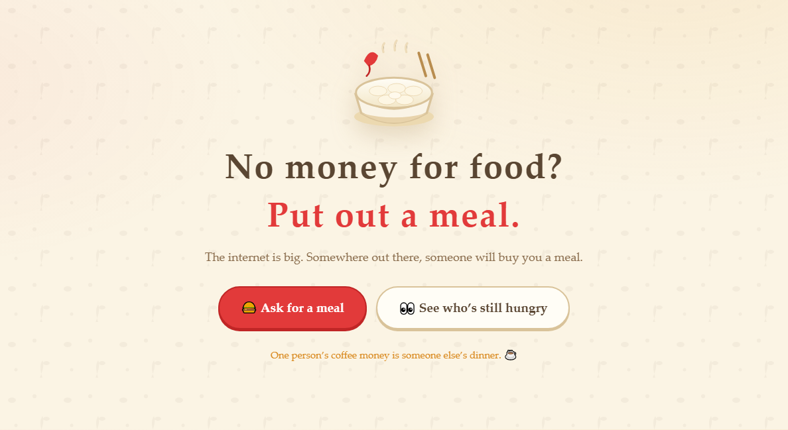

# 🍔 Fanwaner

> 🌏 **中文版：[README.zh-CN.md](README.zh-CN.md)**

<p align="center">
  
</p>

**Broke? Put out a meal and let a stranger buy it for you.**

An open-source "meal jar" for people on the internet.

Nothing complicated. You can:

- Put out a request
- Say what you want to eat
- Leave a payout method
- Share the link
- Wait for someone kind to chip in
- See who showed up

No VPS. No backend to babysit. No payment processing. No blockchain listener. No private keys.

Just a small, lightweight, slightly rough-around-the-edges meal jar that actually runs.

## 🍽️ Why "Fanwaner"?

The original project is Chinese and called **饭碗儿** (fànwǎnr) — literally "rice bowl". In Chinese, a rice bowl is a metaphor for your livelihood: *"don't break your rice bowl."*

That metaphor doesn't survive translation — "rice bowl" means nothing to an English speaker. So the English build keeps the name **Fanwaner** but drops the metaphor: it's framed as a **meal** you put out for someone to cover. Same idea, no translation tax.

---

## ✨ Features

- 🍔 **Put out a request** — what you want, why, how much, how to get paid. Get a link.
- 💰 **Chip in** — pay the person *directly* (PayPal / Stripe / Ko-fi / Buy Me a Coffee / Wise / Revolut / crypto / WeChat / Alipay), then come back and log it.
- 📝 **Contribution log** — every request keeps a record of who chipped in, plus a leaderboard of the most generous supporters.
- 🔔 **Notifications** — the owner can wire up Discord, Slack, Telegram, ntfy, Pushover, email, a generic webhook, or the Chinese services (WeCom / ServerChan / email). Pushed asynchronously so it never slows down a contribution.
- 🙅 **Reject after the fact** — contributions go live immediately, but the owner can reject a bogus one later and the amount is deducted back automatically.
- 🍽️ **Fully funded & closed** — funded / expired / taken-down requests are tucked into a collapsible section at the bottom of the home page, separate from the ones still hungry.
- 🛡️ **Anti-abuse** — Cloudflare Turnstile plus one request per IP per day (IPs are stored hashed only).
- 🖼️ **Share cards** — every request gets an auto-generated 1200×630 OG image (works on X, Discord, Slack, Telegram, iMessage…).
- 🌍 **Multi-language & multi-currency** — English/Chinese UI, 17 currencies, and per-request payout + notification settings.
- 📱 **Mobile-first** — plain HTML/CSS/JS, zero build step.

## 🌍 Internationalization

This fork was localized for a non-Chinese audience. What changed:

| Area | Before | After |
|---|---|---|
| UI language | Chinese / Chongqing dialect only | `en` + `zh`, switchable in the header, remembered in a cookie |
| Language detection | — | `?lang=` → `lang` cookie → `Accept-Language` → `DEFAULT_LOCALE` |
| Currency | CNY hardcoded (`target_cents`, `≤100000` CHECK) | 17 currencies, per-request; zero-decimal currencies (JPY/KRW) handled correctly |
| Payout methods | WeChat, Alipay, USDT (TRC20/BEP20), PayPal | + Stripe, Ko-fi, Buy Me a Coffee, Wise, Revolut, BTC, ETH, SOL, USDT-ERC20 |
| Notification channels | WeCom, ServerChan, Telegram, email | + Discord, Slack, ntfy, Pushover, generic webhook |
| API errors | Chinese literals | localized via `src/lib/locales.js` |
| OG share image | Chinese text, ¥ amounts, 16 MB CJK font | localized, currency-aware, latin font supported (~300 KB) |
| Time display | hardcoded UTC+8 | rendered in the visitor's local timezone |

Server-side copy lives in `src/lib/locales.js`; client-side copy lives in
`static/i18n/en.json` and `static/i18n/zh.json` — 365 keys, kept in lockstep by `npm run check`.

**Adding a language:** copy `static/i18n/en.json` → `static/i18n/xx.json`, add `xx` to
`SUPPORTED` in `static/js/i18n.js`, then add an `xx` block to `src/lib/locales.js` and
register it in `SUPPORTED_LOCALES`. Nothing else needs to change.

> 📖 A longer, Chinese-language write-up of the whole localization effort — including the
> remaining gaps — is in [`docs/I18N_GUIDE.md`](docs/I18N_GUIDE.md).

## 🏗️ Tech stack

| Layer | What |
|---|---|
| Frontend | Plain HTML/CSS/JS, zero build |
| API / hosting | Cloudflare Workers (one Worker serves everything) |
| Database | Cloudflare D1 (SQLite) |
| Images / fonts | Cloudflare R2 |
| Bot protection | Cloudflare Turnstile |
| OG images | cf-workers-og (Satori + resvg WASM) |
| Source | GitHub, MIT |

## 📁 Project structure

```
fanwaner/
├── wrangler.toml              # Worker / assets / D1 / R2 / vars config
├── schema.sql                 # Full DDL (kept in sync with migrations)
├── migrations/                # D1 migrations 0001 … 0007 (0007 = i18n + multi-currency)
├── src/
│   ├── index.js               # Worker entry: /api/*, /i/*, /og/*, static assets
│   ├── assets.js              # Static assets + dynamic OG meta injection for bowl.html
│   ├── api/                   # bowls / donations / upload / admin / og
│   └── lib/                   # resp, validate, turnstile, ip, slug, db,
│                              # og-render, i18n, locales, currency
├── static/
│   ├── index.html             # Home
│   ├── create.html            # Put out a request
│   ├── bowl.html              # Request detail
│   ├── admin.html             # Admin
│   ├── 404.html               # Not found
│   ├── css/style.css
│   ├── i18n/                  # en.json, zh.json — client-side copy
│   └── js/                    # api, i18n, index, create, bowl, admin
├── scripts/                   # download-font, upload-font, gen-prod-config
├── docs/                      # I18N_GUIDE.md, email-notification guide (zh)
└── .github/workflows/deploy.yml   # Manual "Run workflow" → migrate D1 + deploy
```

## 🚀 Run it locally

Requires [Node.js 18+](https://nodejs.org/) and a logged-in Cloudflare account (`wrangler login`).

```bash
# 1. Clone and install
git clone https://github.com/<your-username>/fanwaner.git
cd fanwaner
npm i

# 2. Create the D1 database and R2 bucket; paste the database_id into wrangler.toml
npx wrangler d1 create fanwaner
npx wrangler r2 bucket create fanwaner-assets

# 3. Create a Turnstile site (dash.cloudflare.com → Turnstile)
#    and put the Site Key into wrangler.toml as TURNSTILE_SITE_KEY

# 4. Local secrets (copy the example, fill in three values)
cp .env.example .dev.vars

# 5. Apply migrations locally and start the dev server
npm run db:local
npm run dev
```

Open `http://localhost:8787` and walk the loop: create a request → detail page → chip in → admin.

> Turnstile is skipped locally when no secret is configured, which makes debugging easy.
> It is **required** in production.

## ☁️ Deploy to Cloudflare (no CLI needed)

Everything below happens in a browser — nothing to install, no commands to run.

### 1. Fork the repo

Open [github.com/cunzhangcrypto/fanwan](https://github.com/cunzhangcrypto/fanwan) and click **Fork**.
(Or use your own fork/remote — see notes at the bottom.)

### 2. Prepare Cloudflare (~5 minutes, all clicks)

Open [dash.cloudflare.com](https://dash.cloudflare.com):

1. **D1 database** — Workers & Pages → D1 → Create database (name it `fanwaner`) → copy the **Database ID**
2. **R2 bucket** — R2 → Create bucket, named `fanwaner-assets`
3. **Turnstile site** — Turnstile → Add site (domain can be `*` for now) → copy the **Site Key** and **Secret Key**
4. **API token** — avatar (top right) → My Profile → API Tokens → Create Token → template **Edit Cloudflare Workers** → Create → copy the token
5. **Account ID** — shown in the right-hand sidebar of the dashboard

### 3. Add GitHub Actions secrets

In your fork: **Settings → Secrets and variables → Actions → New repository secret**.

| Secret | Value |
|---|---|
| `CLOUDFLARE_API_TOKEN` | step 2.4 |
| `CLOUDFLARE_ACCOUNT_ID` | step 2.5 |
| `D1_DATABASE_ID` | step 2.1 |
| `R2_BUCKET` | bucket name (default `fanwaner-assets`) |
| `TURNSTILE_SITE_KEY` | Turnstile Site Key |
| `TURNSTILE_SECRET_KEY` | Turnstile Secret Key |
| `SERVER_SECRET` | any random string (IP-hash salt) |
| `ADMIN_KEY` | any random string (admin bearer token) |
| `TELEGRAM_BOT_TOKEN` | *(optional)* only needed if owners should get Telegram pings |

> Notification secrets are optional — if you skip them, owners who wired up those channels
> just won't receive pings; everything else works.
> **Email notifications need no secrets**: the owner configures their own email API
> (see below), billed to their own account, not yours.

> `SITE_URL` is not required — share-image URLs are built from the incoming request host,
> so they stay correct with or without a custom domain.

### 4. Trigger the deploy

Your repo → **Actions** → **Deploy** → **Run workflow**.

After 1–2 minutes, if the run is green you're live: it applies migrations → uploads the font →
sets Worker secrets → deploys.

### 5. Verify

The deploy log prints your `https://fanwaner.<your-subdomain>.workers.dev` URL. Open it.

To use a custom domain: Workers → fanwaner → Settings → Domains & Routes → Add.

---

## 🧑‍💻 Deploy from the CLI (advanced)

```bash
# 1. Secrets — never commit these
npx wrangler secret put TURNSTILE_SECRET_KEY
npx wrangler secret put SERVER_SECRET       # random string, used for IP hashing
npx wrangler secret put ADMIN_KEY           # admin bearer token
npx wrangler secret put TELEGRAM_BOT_TOKEN  # optional

# 2. Apply migrations (7 total, including the i18n/multi-currency one)
npm run db:remote

# 3. Upload a font for OG images
npm run font:download   # ~16 MB CJK font by default
npm run font:upload

# 4. Deploy
npm run deploy
```

> ⚠️ **Back up first.** Migration `0007_i18n.sql` **rebuilds the `bowls` and `donations`
> tables** (SQLite can't alter a CHECK constraint in place). Always run
> `npx wrangler d1 export fanwaner --remote --output backup.sql` before applying it to
> a database that already has data.

For an English-facing deployment, swap the font to a latin one — it's ~300 KB instead of 16 MB:

```toml
R2_FONT_KEY = "fonts/NotoSans-Regular.ttf"
```

The font family name is derived from the R2 key automatically
(`NotoSans-Regular.ttf` → `NotoSans`); override with `OG_FONT_NAME` if your key doesn't match.

Custom domain:

```toml
routes = [{ pattern = "fanwaner.example.com", custom_domain = true }]
```

## 🔑 Environment variables

**Secrets** (Worker secrets / GitHub Actions secrets):

| Name | Purpose |
|---|---|
| `TURNSTILE_SECRET_KEY` | Server-side Turnstile verification |
| `SERVER_SECRET` | Salt for IP hashing (daily limit) |
| `ADMIN_KEY` | Admin bearer token |
| `TELEGRAM_BOT_TOKEN` | *(optional)* only if owners should get Telegram pings |

**`[vars]` in `wrangler.toml`:**

| Name | Default | Purpose |
|---|---|---|
| `TURNSTILE_SITE_KEY` | `""` | Public Turnstile site key used by the frontend |
| `MAX_AMOUNT_YUAN` | `1000` | Per-entry amount cap, in **major units of the request's currency** (USD → $1000, JPY → ¥1000). Legacy name. |
| `MAX_UPLOAD_BYTES` | `2097152` | Image upload cap (2 MB) |
| `R2_FONT_KEY` | `fonts/NotoSansSC-Regular.otf` | Font used by the OG renderer |
| `OG_FONT_NAME` | *(derived)* | Font family name; usually unnecessary |
| `SITE_URL` | `""` | Not needed — share URLs use the request host |
| `DEFAULT_LOCALE` | `en` | Fallback UI/API language (`en` / `zh`) |
| `DEFAULT_CURRENCY` | `USD` | Default currency for new requests |
| `NTFY_API` | `https://ntfy.sh` | Point at a self-hosted ntfy instance if you prefer |
| `AUTO_APPROVE_DONATIONS` | `true` | `true` = contributions go live instantly; `false` = owner must approve first |

## 📧 Email notifications (owner-configured, zero cost to the host)

Email doesn't go through any platform mailbox. The owner enters their own email API in
the request's notification settings; the Worker just POSTs to it. Any
**Resend-compatible** HTTP email API works.

Using [Resend](https://resend.com) (free tier is enough, no card required):

1. Sign up, go to **API Keys**, create a key (starts with `re_`)
2. In the request's notification settings, fill in:
   - **Recipient email** — where pings should go
   - **Email API URL** — `https://api.resend.com/emails` (the default)
   - **Email API key** — the `re_xxx` value
   - **From** — optional; defaults to `onboarding@resend.dev`. To send from your own
     domain, verify it with Resend and use the `Alias <email>` format.
3. Save. Notes on your request now trigger an email.

> API keys are never echoed back or returned by the API; leaving the field blank keeps
> the existing key.

## 🔌 API

All responses are `{ ok, data }` or `{ ok: false, error: { code, message } }`.
Error `message` is localized based on the request language.

| Endpoint | Description |
|---|---|
| `GET /api/config` | Public config: Turnstile site key, amount cap, default locale/currency, currency list, payout methods, auto-approve flag |
| `GET /api/bowl` | List requests (`?status=&sort=&page=`; `status` accepts a comma list like `completed,expired,hidden`) |
| `POST /api/bowl` | Create a request (Turnstile + daily IP limit + validation). Accepts `currency`, `language`, payout and notification fields |
| `GET /api/bowl/:slug` | Request detail, including published contributions (status is lazily refreshed: expired / funded) |
| `PUT /api/bowl/:slug` | Edit a request (requires `editToken`). Currency is locked once money has come in |
| `GET /api/bowl/:slug/pending` | Owner view (`?token=editToken`) → `{ pending, rejected, approved, autoApprove }` |
| `POST /api/bowl/:slug/approve` | Publish a pending contribution (no-op when auto-approve is on) |
| `POST /api/bowl/:slug/reject` | Reject a contribution; if it was already counted, the amount is refunded back |
| `POST /api/donation` | Chip in. **Published instantly by default** (`AUTO_APPROVE_DONATIONS`); notifications are pushed asynchronously |
| `DELETE /api/donation/:id` | Withdraw your own contribution (requires `deleteToken`) |
| `POST /api/upload` | Upload an image to R2 (avatar / payout QR) |
| `GET /api/admin/pending` | Admin: pending + recently published contributions (`Bearer ADMIN_KEY`) |
| `POST /api/admin/approve` / `reject` / `delete` | Admin moderation |
| `GET /i/:key` | Serve an R2 image (immutable cache) |
| `GET /og/:slug.png` | OG share image, lazily rendered and cached in R2. Language follows the request's stored language |

## 🛡️ Anti-abuse & security

- **Turnstile** on both creating a request and chipping in: the frontend fetches the site
  key from `GET /api/config`, and the Worker re-verifies server-side with the secret.
- **Daily IP limit** — `daily_key = SHA-256(ip + date + SERVER_SECRET)` with a DB unique
  constraint to survive races. Raw IPs are never stored, and contribution records only
  keep the hash.
- **XSS** — all user content is rendered via `textContent`.
- **Admin** — `ADMIN_KEY` as a bearer token, stored only as a Worker secret.
- **Uploads** — the frontend converts to webp via canvas; the backend verifies the magic
  bytes, enforces 2 MB, and rate-limits per IP.

## 💛 Support this project

Fanwaner is free and MIT-licensed. If it's useful to you, you can:

- Star the repo, or send a pull request
- Chip in on the upstream author's page — their payout details (WeChat / Alipay / USDT)
  are in [README.zh-CN.md](README.zh-CN.md#-赏口饭吃)
- **Running your own instance?** Replace that section with your own payout details before
  you publish, so people don't send money to the wrong place.

## ⚠️ Disclaimer

Fanwaner is **not** a payment platform. It does not collect, hold, or move money, and it
does not watch the blockchain.

Money goes **directly** from the supporter to the person asking. Fanwaner only records
that someone chipped in.

Double-check addresses before sending — a wrong address cannot be undone by anyone.

## 📄 License

[MIT](LICENSE)

---

> Don't ask. Just eat first. 🍔
